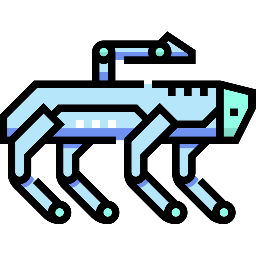
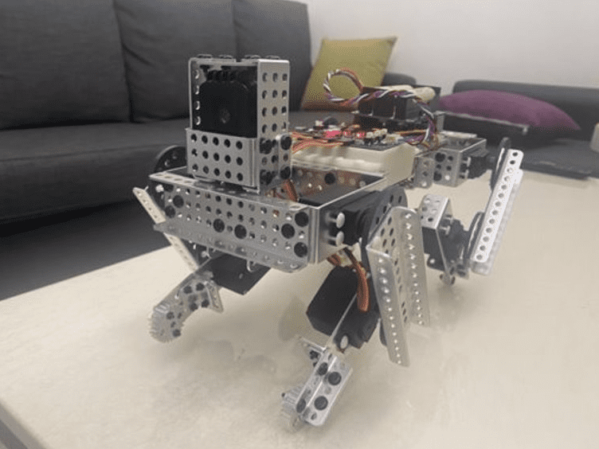

<div id="top"></div>

<!-- PROJECT LOGO -->
<br />
<div align="center">
  

  <h3 align="center">Best Quadruped Robot - Tempura</h3>

  <p align="center">
    A low cost quadruped robot made by Matrix Robotics.
    <br />
    <a href="https://github.com/RUI-LONG/tempura"><strong>Explore the docs »</strong></a>
    <br />
    <br />
    <a href="https://youtu.be/q66Qkyj64FU">View Demo</a>
    ·
    <a href="https://github.com/RUI-LONG/tempura/issues">Report Bug</a>
    ·
    <a href="https://github.com/RUI-LONG/tempura/issues">Request Feature</a>
  </p>
</div>


<!-- TABLE OF CONTENTS -->
<details>
  <summary>Table of Contents</summary>
  <ol>
    <li>
      <a href="#about-the-project">About The Project</a>
      <ul>
        <li><a href="#built-with">Built With</a></li>
      </ul>
    </li>
    <li>
      <a href="#getting-started">Getting Started</a>
      <ul>
        <li><a href="#prerequisites">Prerequisites</a></li>
        <li><a href="#installation">Installation</a></li>
      </ul>
    </li>
    <li><a href="#usage">Usage</a></li>
    <li><a href="#roadmap">Roadmap</a></li>
    <li><a href="#contributing">Contributing</a></li>
    <li><a href="#license">License</a></li>
    <li><a href="#contact">Contact</a></li>
    <li><a href="#acknowledgments">Acknowledgments</a></li>
  </ol>
</details>

<!-- ABOUT THE PROJECT -->
## About The Project
<p align="center">

<p>
Tempura is not only a walking robot cat, it can be brought to life with customizable software, Matrix Robotics kit, and any upgrade you can imagine! ​<br>

Here's why:
* It can recognize 10 different hand gestures. ​
* It has more than 12 movement functions. ​

Tempura's movement is driven by Raspberry pi and Matrix Servo Extension. ​<br>
And Tempura's vision uses the exclusive Machine Learning Pipeline, which includes Hand Tracking, Gesture Recognition and Robot Motion Control System.​

<!-- GETTING STARTED -->
## Getting Started

### Hardware Setup
[Hardware Setup](./Hardware.md)

### Installation

Note that tempura repository has two sub-modules: Raspi-I2C and depthai-hand-tracker.

1. If you want to install all sub modules, you can run the following command:
  ```sh
  git clone https://github.com/RUI-LONG/tempura.git --recursive
  ```
  Otherwise, just run the following command:
  ```sh
  git clone https://github.com/RUI-LONG/tempura.git
  ```

2. Install requirements:
  ```sh
  cd tempura/depthai-hand-tracker
  python3 -m pip install -r requirements.txt
  cd ..
  ```
<p align="right">(<a href="#top">back to top</a>)</p>

## Software Architecture

Tempura repository three folders: Raspi-I2C 、 depthai-hand-tracker and movements. <br><br>
movements: All movements are stored in this folder, checkout Movement/movement.py for more details. <br>
Raspi-I2C: Using I2C to connect to Matrix Servo Extension. <br>
depthai-hand-tracker: Using depthai to track hands and recognize hand gestures. Checkout [depthai-hand-tracker](./https://github.com/RUI-LONG/depthai_hand_tracker) for more details. <br>

<!-- USAGE EXAMPLES -->
## Usage

1. If you want to simply run a demo, you can run the following command:
  ```sh
  python main.py
  ```

2. If you want to run a demo with a specific movement, you can run the following command:
  ```sh
  python test_motions.py
  ```

<p align="right">(<a href="#top">back to top</a>)</p>

<!-- CONTRIBUTING -->
## Contributing

Contributions are what make the open source community such an amazing place to learn, inspire, and create. Any contributions you make are **greatly appreciated**.

If you have a suggestion that would make this better, please fork the repo and create a pull request. You can also simply open an issue with the tag "enhancement".
Don't forget to give the project a star! Thanks again!

1. Fork the Project
2. Create your Feature Branch (`git checkout -b feature/AmazingFeature`)
3. Commit your Changes (`git commit -m 'Add some AmazingFeature'`)
4. Push to the Branch (`git push origin feature/AmazingFeature`)
5. Open a Pull Request

<p align="right">(<a href="#top">back to top</a>)</p>

<!-- LICENSE -->
## License

<!-- CONTACT -->
## Contact

GitHub: [RUI-LONG](https://github.com/RUI-LONG)

<!-- ACKNOWLEDGMENTS -->
## Acknowledgments

* [DepthAI](https://docs.luxonis.com/en/latest/)

<p align="right">(<a href="#top">back to top</a>)</p>

